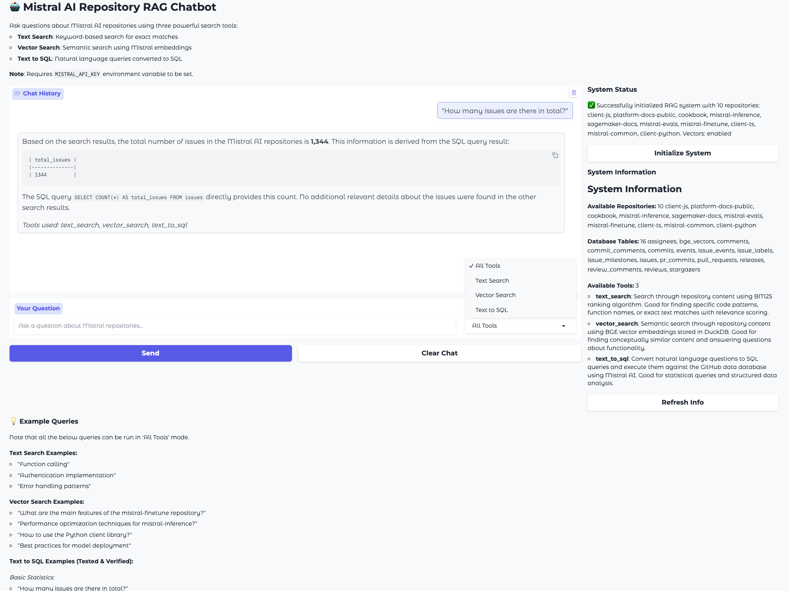
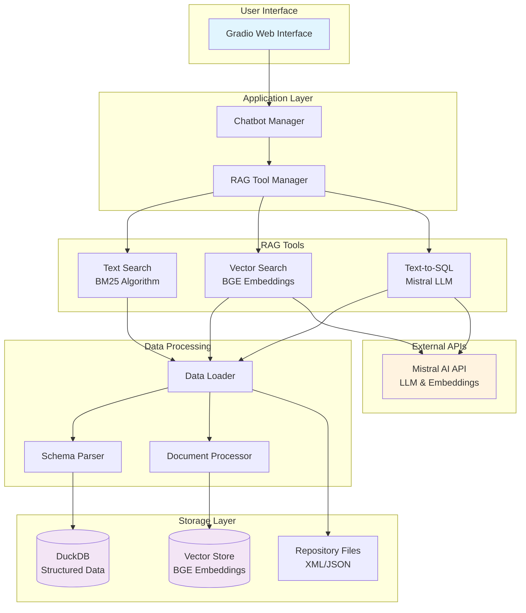

# 🤖 Mistral AI Repository RAG Chatbot

A powerful RAG (Retrieval-Augmented Generation) chatbot for querying Mistral AI repositories using natural language. Combines text search, semantic search, and SQL queries to provide comprehensive answers about Mistral's codebase and development activities.

## 🚀 Quick Start

Note that this repository includes a large (Git LFS tracked) DuckDB database. Check that this is included when the repo is cloned (may require a newer version of Git).

1. **Install dependencies (`uv` recommended)**:
   ```bash
   uv venv
   source .venv/bin/activate
   uv sync 
   ```

2. **Set your Mistral API key**:
   ```bash
   export MISTRAL_API_KEY="your-api-key-here" or add it to `.env` based on `.env.example`
   ```

3. **Launch the chatbot**:
   ```bash
   python app.py
   ```

4. **Open your browser** to `http://localhost:7860`

## 📸 Interface Preview



*The Gradio web interface showing the multi-tool search capabilities with text search, vector search, and text-to-SQL functionality.*

## 🏗️ Architecture



## 🔍 Search Capabilities

### Text Search (BM25)
Fast keyword-based search for exact matches:
- `"function calling"`
- `"authentication implementation"`
- `"error handling patterns"`

### Vector Search (Semantic)
AI-powered semantic understanding:
- `"How to use the Python client library?"`
- `"What are the main features of mistral-finetune?"`
- `"Performance optimization techniques"`

### Text-to-SQL (Tested & Verified)
Natural language to SQL conversion with intelligent retry loops:

**Basic Statistics:**
- `"How many issues are there in total?"`
- `"How many open issues are there?"`
- `"Count the total number of comments"`

**Repository Analysis:**
- `"Which repository has the highest number of issues?"`
- `"Show me all repositories and their issue counts"`
- `"Show the distribution of issue states across repositories"`

**User & Contributor Analysis:**
- `"Who are the top 5 most active issue creators?"`
- `"Find the most active contributors across all repositories"`
- `"Show me issue authors and their usernames"`

**Content-Based Searches:**
- `"Find issues that mention 'API' in the title"`
- `"Show me issues related to authentication"`
- `"Search for issues containing 'error' or 'exception'"`

**Time-Based Queries:**
- `"Show me the most recent 10 issues"`
- `"Find issues created in 2024"`
- `"Show pull requests created in the last month"`

**Advanced Analytics:**
- `"Find the most commented issues"`
- `"Calculate average issues per repository"`
- `"Show repositories ordered by activity level"`

## 🛠️ Key Features

- **🔄 Intelligent Retry Logic**: Automatically fixes SQL errors and retries failed queries
- **🎯 Multi-Tool Search**: Use all search methods simultaneously for comprehensive results
- **📊 Rich Data Visualization**: JSON results formatted as tables and charts
- **⚡ High Performance**: Optimized BM25 indexing and vector caching
- **🔍 Error Analysis**: Detailed error tracking and resolution patterns

## 📁 Project Structure

```
example-rag/
├── src/
│   ├── chatbot.py         # Gradio web interface
│   ├── rag_tools.py       # Search tools (Text/Vector/SQL)
│   └── data_loader.py     # Data processing & DB management
├── tests/                 # Comprehensive test suite
├── data/mistral-repos/    # Repository XML files
├── app.py                 # Main application entry
└── db.duckdb             # DuckDB database
```

## 📊 Supported Data Sources

### Repository Content (10+ Mistral Repos)
- mistral-inference, mistral-common, mistral-finetune, client-python, client-js, client-ts,cookbook, platform-docs-public, Source code, documentation, configurations

### GitHub Data (DuckDB Tables)
- **Issues**: 1,344 issues across repositories
- **Pull Requests**: 800+ PRs with merge status
- **Comments**: 1,400+ community discussions
- **Events**: Repository activity and commits
- **Users**: Contributors and assignees

## 📥 Data Collection Tools

This project uses two tools to collect comprehensive repository data:

### 🗂️ Repomix - Repository Code Extraction

[Repomix](https://github.com/yamadashy/repomix) extracts and packages repository source code into XML format for AI analysis.

**Installation:**
```bash
npm install -g repomix
```

**Usage:**
```bash
# Extract repository code to XML
repomix https://github.com/mistralai/mistral-inference

# Output: repomix-output.xml (contains structured source code)
```

### 🐙 Singer Tap-GitHub - Repository Metadata

[Singer Tap-GitHub](https://github.com/singer-io/tap-github) extracts comprehensive GitHub repository metadata including issues, pull requests, comments, and more. See README.md in `singer-tap-github` to understand how data is extracted and loaded into DuckDB.

### 🔄 Collection Workflow

The workflow:
1. Uses repomix to extract source code from each repository
2. Uses tap-github to collect GitHub metadata
3. Processes and indexes the data for RAG queries on initial initialization
4. Stores everything in DuckDB for fast SQL access

**Built with ❤️ for the Mistral AI community**

*Powered by Mistral AI, LlamaIndex, Gradio, and DuckDB*
